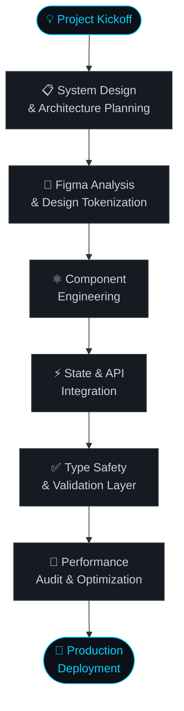

<div align="center">


</div>

<br/>

<div align="center">

[](https://git.io/typing-svg)

</div>

<br/>

<div align="center">
  
[](https://www.linkedin.com/in/aditto-dev/)
[](mailto:adittodev01770@gmail.com)
[](https://koushik-psi.vercel.app/)
[](https://github.com/Adityo-dev)

</div>

---

## 👨‍💻 About Me

> *"Code is poetry written in logic."*

I'm a **Frontend Developer** from Bangladesh, dedicated to crafting high-performance, visually stunning, and user-centric web applications. I sit at the intersection of **engineering precision** and **design aesthetics** — writing clean, maintainable code while delivering pixel-perfect digital experiences.

```typescript
const adityo = {
  role       : "Frontend Developer",
  location   : "Bangladesh 🇧🇩",
  focus      : ["Next.js", "TypeScript", "Tailwind CSS"],
  building   : ["Multi-vendor E-learning Marketplace", "API Monitoring System"],
  passions   : ["Clean Code", "Pixel-Perfect UI", "Performance", "Open Source"],
  funFact    : "Powered by ☕ coffee and 🎵 lofi beats",
};
```

---

## 🚀 What I Do

<table>
<tr>
<td width="50%">

**⚡ State Management**
Scalable, predictable frontend architecture using Redux Toolkit & RTK Query for blazing-fast data fetching and caching.

</td>
<td width="50%">

**🎨 UI Engineering**
Crafting interactive, animated interfaces with Shadcn UI, Framer Motion & SwiperJS that users love.

</td>
</tr>
<tr>
<td width="50%">

**🔒 Type Safety & Validation**
TypeScript-first development with React Hook Form + Zod for bulletproof, runtime-validated forms.

</td>
<td width="50%">

**🏗️ System Architecture**
Designing scalable frontend systems for complex Marketplace & E-learning platforms with clean component structure.

</td>
</tr>
</table>

---

## 🛠️ Tech Stack & Tools

<table align="center" width="100%">
  <tr>
    <td align="center" width="33%">
      <strong>Frontend Core</strong><br/><br/>
      
    </td>
    <td align="center" width="33%">
      <strong>Modern Libraries</strong><br/><br/>
      
      
      <br/>
      
      
    </td>
    <td align="center" width="33%">
      <strong>Workflow Tools</strong><br/><br/>
      
    </td>
  </tr>
</table>

---

## 📊 GitHub Stats

<div align="center">


</div>

<details>
<summary align="center">📈 <b>View Contribution Activity Graph</b></summary>
<br/>
<div align="center">

</div>
</details>

---

## 🏆 GitHub Trophies

<div align="center">

</div>

---

## 🔄 Professional Workflow

> From idea to production — a disciplined, quality-first engineering process.



<br/>

<table width="100%">
  <thead>
    <tr>
      <th align="center">Phase</th>
      <th align="left">Activity</th>
      <th align="left">Tools & Methods</th>
      <th align="center">Output</th>
    </tr>
  </thead>
  <tbody>
    <tr>
      <td align="center"><b>01</b><br/>📋</td>
      <td><b>System Design</b><br/><sub>Architecture & feature mapping for complex platforms like E-learning Marketplaces</sub></td>
      <td>
        
        
      </td>
      <td align="center">📄 Spec Doc</td>
    </tr>
    <tr>
      <td align="center"><b>02</b><br/>🎨</td>
      <td><b>Figma → Code</b><br/><sub>Pixel-perfect translation of UI designs into reusable, responsive component systems</sub></td>
      <td>
        
        
      </td>
      <td align="center">🧩 Components</td>
    </tr>
    <tr>
      <td align="center"><b>03</b><br/>⚛️</td>
      <td><b>Component Engineering</b><br/><sub>Building atomic, composable UI components with strict TypeScript interfaces and prop validation</sub></td>
      <td>
        
        
        
      </td>
      <td align="center">📦 UI Library</td>
    </tr>
    <tr>
      <td align="center"><b>04</b><br/>⚡</td>
      <td><b>State & API Integration</b><br/><sub>Wiring up global state and server data with RTK Query — intelligent caching, optimistic updates & real-time sync</sub></td>
      <td>
        
        
      </td>
      <td align="center">🔗 Data Layer</td>
    </tr>
    <tr>
      <td align="center"><b>05</b><br/>✅</td>
      <td><b>Type Safety & Validation</b><br/><sub>End-to-end type safety with TypeScript + schema-driven runtime validation on all form inputs and API responses</sub></td>
      <td>
        
        
      </td>
      <td align="center">🛡️ Safe Forms</td>
    </tr>
    <tr>
      <td align="center"><b>06</b><br/>🧪</td>
      <td><b>Performance Audit</b><br/><sub>Lighthouse optimization, bundle analysis, lazy loading, image optimization & Core Web Vitals tuning</sub></td>
      <td>
        
        
      </td>
      <td align="center">📊 Audit Report</td>
    </tr>
    <tr>
      <td align="center"><b>07</b><br/>🚀</td>
      <td><b>Production Deployment</b><br/><sub>CI/CD pipeline → Vercel edge deployment with automatic preview URLs, rollback support & environment configs</sub></td>
      <td>
        
        
      </td>
      <td align="center">🌐 Live App</td>
    </tr>
  </tbody>
</table>

---

## 🌐 Let's Build Something Amazing

<div align="center">

| | |
|---|---|
| 🌍 **Portfolio** | [koushik-psi.vercel.app](https://koushik-psi.vercel.app/) |
| 💼 **LinkedIn** | [linkedin.com/in/aditto-dev](https://www.linkedin.com/in/aditto-dev/) |
| 📧 **Email** | [adittodev01770@gmail.com](mailto:adittodev01770@gmail.com) |
| 💻 **GitHub** | [github.com/Adityo-dev](https://github.com/Adityo-dev) |

</div>

<br/>

<div align="center">

*Open to exciting **Frontend collaborations**, **freelance projects**, and **open source contributions**. If you have an idea — let's make it real.* 🚀

</div>

<br/>

<div align="center">

</div>
