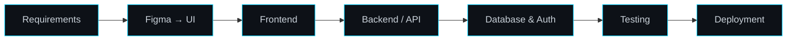

<div align="center">


<a href="https://www.linkedin.com/in/aditto-dev/"></a>
<a href="mailto:adittodev01770@gmail.com"></a>
<a href="https://koushikbarmon.vercel.app/"></a>


</div>

<br/>

## About Me

I'm a **Full Stack Web Developer** based in Bangladesh 🇧🇩, working across the full product lifecycle — from Figma designs and frontend architecture to backend APIs, authentication, databases, and production deployment.

I focus on clean engineering, thoughtful UI/UX, and maintainable architecture that turns ideas into reliable products. Currently running my own web development agency, **[Wexlye](mailto:aditto@wexlye.com)**, building for international clients.

```ts
const adityo = {
  role: "Full Stack Web Developer",
  location: "Bangladesh 🇧🇩",
  experience: "3+ years",
  frontend: ["Next.js", "React", "TypeScript", "Tailwind CSS", "Redux Toolkit"],
  backend: ["Node.js", "Express.js", "MongoDB", "PostgreSQL", "JWT Auth"],
  tools: ["Git", "Figma", "Postman", "Vercel", "pnpm"],
  currentlyBuilding: "Wexlye — a web development agency for global clients",
};
```

<br/>

## Tech Stack

<table>
<tr>
<td valign="top" width="33%">

**Frontend**


<br/>


</td>
<td valign="top" width="33%">

**Backend & Database**


<br/>

<br/><br/>


</td>
<td valign="top" width="33%">

**Tools & Libraries**


<br/><br/>


</td>
</tr>
</table>

<br/>

## GitHub Stats

<div align="center">


<br/>

</div>

<br/>

## Workflow


```mermaid
flowchart LR
    A[Requirements] --> B[Figma → UI]
    B --> C[Frontend]
    C --> D[Backend / API]
    D --> E[Database & Auth]
    E --> F[Testing]
    F --> G[Deployment]

    style A fill:#0d1117,stroke:#00d2ff,color:#c9d1d9
    style B fill:#0d1117,stroke:#00d2ff,color:#c9d1d9
    style C fill:#0d1117,stroke:#00d2ff,color:#c9d1d9
    style D fill:#0d1117,stroke:#00d2ff,color:#c9d1d9
    style E fill:#0d1117,stroke:#00d2ff,color:#c9d1d9
    style F fill:#0d1117,stroke:#00d2ff,color:#c9d1d9
    style G fill:#0d1117,stroke:#00d2ff,color:#c9d1d9
```

<br/>

## Featured Work

**🎓 EduNext — Multi-Role Learning Platform**
Full-stack e-learning platform with separate Admin, Instructor, and Student experiences.
`Next.js` · `TypeScript` · `Node.js` · `Express` · `MongoDB` · `JWT` · `Redux Toolkit`
🔗 [Live Demo](https://edunext-six.vercel.app/)

**🛍️ XStore — Modern E-commerce Experience**
Responsive e-commerce frontend with product discovery, filtering, and cart management.
`Next.js` · `TypeScript` · `Tailwind CSS` · `Swiper`
🔗 [Live Demo](https://xstore-jet.vercel.app/)

<br/>

## Let's Connect

<div align="center">

<a href="https://koushikbarmon.vercel.app/"></a>
<a href="https://www.linkedin.com/in/aditto-dev/"></a>
<a href="mailto:adittodev01770@gmail.com"></a>
<a href="https://github.com/Adityo-dev"></a>

<br/><br/>

**Open to freelance projects, collaborations, and interesting product ideas.**

</div>


